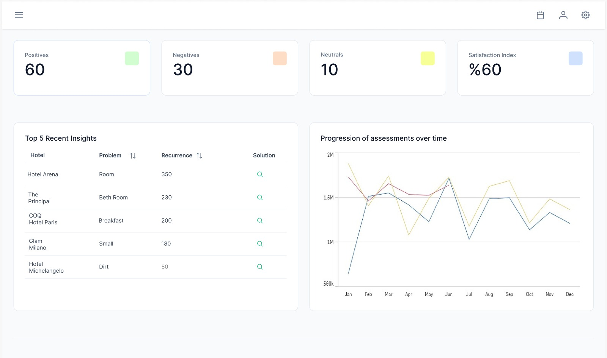
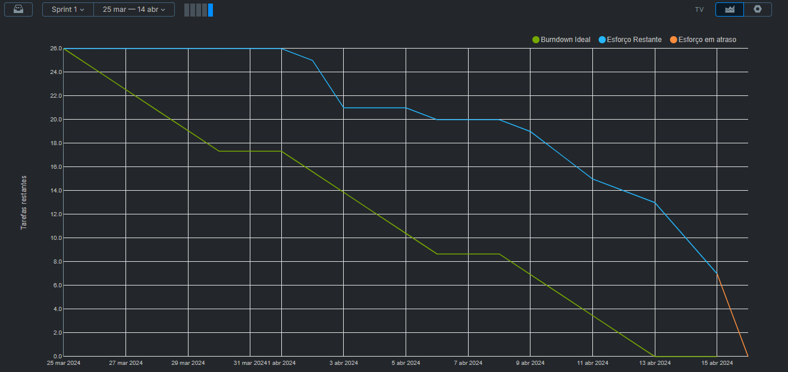

<h4 align="center"> 
 
 
 
 
</h4>

## ✏️ **CHALLENGE**

The challenge is to develop an advanced platform to collect, analyze, and visualize data from online reviews using sentiment analysis, non-relational database storage, and machine learning technologies. The goal is to provide businesses with precise insights into customer perception, enabling adjustments in marketing strategies, product development, and customer service, with a focus on adapting to the digital economy and strengthening relationships with consumers worldwide.

`Functional Requirements`
- Geolocated Sentiment Visualization
- Authentication and Session Management
- Multisource Reviews Integration
- Data Storage and Management
- Data Visualization and Reporting

`Non-Functional Requirements`
- Compliance and Security
- Interoperability and Integration
- Performance and Scalability

## Solution

## 📅 **SPRINTS SCHEDULE**

- [X] **Kickoff** - 04/03/2024 to 08/03/2024

- [X] **SPRINT 1** - 25/03/2024 to 14/04/2024

- [ ] **SPRINT 2** - 15/04/2024 to 05/05/2024

- [ ] **SPRINT 3** - 06/05/2024 to 26/05/2024

- [ ] **SPRINT 4** - 27/05/2024 to 16/06/2024

## 🎯 **SPRINT BACKLOG**
<table>
  <thead>
    <tr>
      <th>Requirement</th>
      <th>Priority</th>
    </tr>
  </thead>
  <tbody>
    <tr>
      <td>
Identify relevant data sources for sentiment analysis.

      <td>High</td>
    </tr>
    <tr>
      <td>
        
Acquire suitable data sets for model training.

      </td>
      <td>High</td>
    </tr>
    <tr>
      <td>
        
Perform initial data cleaning, removing noise and irrelevant data.

      </td>
      <td>Medium</td>
    </tr>
    <tr>
      <td>
        
Select sentiment analysis algorithms suited to the project’s needs.

      </td>
      <td>Medium</td>
    </tr>
    <tr>
      <td>
        
Develop and train machine learning models using the prepared datasets.

      </td>
      <td>Medium</td>
    </tr>
    <tr>
      <td>
        
Configure Folium access for geographic mapping.

      </td>
      <td>Low</td>
    </tr>
    <tr>
      <td>
        
Design and develop the user interface to display sentiment analysis results geographically.

      </td>
      <td>Low</td>
    </tr>
   <td>
        
Design and develop the user interface to display sentiment analysis results geographically.

      </td>
      <td>Low</td>
    </tr>
  </tbody>
</table>

## Backlog
<table>
  <thead>
    <tr>
      <th>Requirement</th>
      <th>Priority</th>
    </tr>
  </thead>
  <tbody>
    <tr>
      <td>
Identify and acquire relevant datasets for training and testing sentiment models.
</td>
      <td>High</td>
    </tr>
    <tr>
      <td>
Perform initial data preprocessing, including cleaning, tokenization, and vectorization.
</td>
      <td>High</td>
    </tr>
    <tr>
      <td>
Develop and train machine learning models to process data and perform sentiment analysis.
</td>
      <td>Medium</td>
    </tr>
    <tr>
      <td>
Select suitable algorithms and train them using prepared datasets.
</td>
      <td>Medium</td>
    </tr>
    <tr>
      <td>
Implement integration with the Google Maps API for geographical data visualization as per client needs.
</td>
      <td>Low</td>
    </tr>
    <tr>
      <td>
Integrate the ChatGPT API for sentiment analysis and generation of relevant insights based on provided data.
</td>
      <td>Low</td>
    </tr>
    <tr>
      <td>
Develop data visualizations based on Business Intelligence (BI) analysis to display sentiments comprehensively.
</td>
      <td>Low</td>
    </tr>
    <tr>
      <td>
Evaluate the accuracy and effectiveness of sentiment models using metrics such as accuracy, precision, recall, and F1-score.
</td>
      <td>Medium</td>
    </tr>
    <tr>
      <td>
Conduct integration tests to ensure efficient communication between Google Maps, ChatGPT APIs, and the system.
</td>
      <td>Medium</td>
    </tr>
    <tr>
      <td>
Implement access management system with permission controls to ensure data security and privacy compliance with LGPD regulations.
</td>
      <td>Medium</td>
    </tr>
    <tr>
      <td>
Develop a mechanism for users to sign terms of use compliant with LGPD guidelines.
</td>
      <td>Medium</td>
    </tr>
  </tbody>
</table>

## Mockup
**Sprint 1**

**Heatmap**

## Burndown 

## 💻 **TECHNOLOGY AND TOOLS**

## Integrantes
| Função                 | Usuário GitHub                                     | Nome                   |
|------------------------|----------------------------------------------------|------------------------|
| Scrum Master           | [Daniloel](https://github.com/Daniloel)            | Danilo Verginio         |
| Product Owner          | [Pedrolucasrd](https://github.com/Pedrolucasrd)    | Pedro Lucas Rodrigues  |
| Team dev               | [alantrs](https://github.com/alantrs)              | Alan Araujo Rodrigues |
| Team dev               | [igorsuzuki99](https://github.com/igorsuzuki99)    | Igor Suzuki Kira      |
| Team dev               | [LucasMonteiiroo](https://github.com/LucasMonteiiroo)| Lucas Monteiro      |
| Team dev               | [WesFerreira](https://github.com/WesFerreira)      | Wesley Ferreira         |
| Team dev               | [BahijJihadNoureddine](https://github.com/BahijJihadNoureddine)  | Bahij Jihad Noureddine   |
